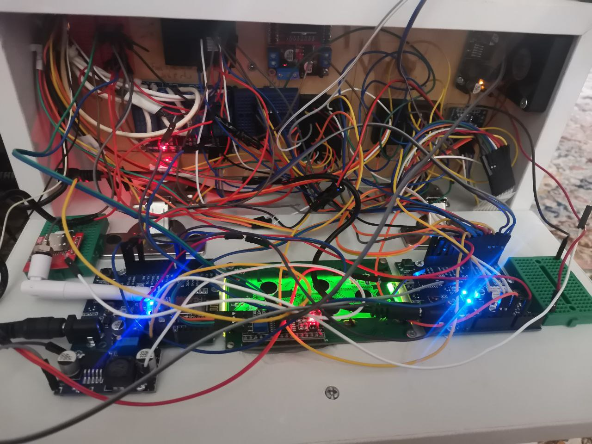

<h1>Project title: Smart incubator project using the Internet of Things</h1>

1- Introduction:
With the increasing population growth of the world and the need for more agricultural products, the use of incubators as a fast and efficient method for raising chicks of chickens and other birds has become very important. With the advancement of technology, facilities such as the Internet of Things can help improve the performance of the incubator. This project is presented with the aim of designing and building a smart incubator using the Internet of Things.

2- Project objectives:
•  Design and build a smart incubator with the ability to control and monitor remotely using the Internet of Things.

•  Increase the efficiency of the incubator by using various sensors that send information to the server and provide the user with the possibility of monitoring and accurate control of the device.

•  Reduce the risks that affect the incubation process such as inappropriate temperature and humidity, power fluctuations, etc.

•  Provide facilities such as recording and displaying the history of the incubation stages and sending alerts in case of any problem in the device.

•  Reduce the maintenance and supervision costs of the incubator by using smart solutions.

3- Project requirements:
•  Incubator with a capacity of at least 8 eggs

•  Temperature and humidity sensors to control the temperature and humidity inside the incubator

•  Light sensors to control the light of the incubation environment

•  Communication protocols such as MQTT and HTTP to establish communication with the server

•  A server for storing information and providing facilities such as monitoring and controlling the incubator

•  User software for monitoring and controlling the incubator remotely

•  Notification and alert system to inform the user in case of any problem in the device

•  Ability to record and display the history of the incubation stages and statistics related to it in the user software

•  Ability to control the parameters of the incubator such as temperature, humidity and light remotely through the user software.

4- Project benefits:
•  Increase the efficiency and quality of incubation by controlling the environmental parameters accurately

•  Reduce the risks that affect the incubation process

•  Reduce the maintenance and supervision costs of the incubator by using smart solutions

•  Increase the speed and accuracy in decision-making related to incubation by accessing accurate data and statistics related to it

•  Ability to monitor and control the incubator remotely using the user software.

5- Project implementation steps:
•  Design and build a smart incubator using the Internet of Things and various sensors

•  Develop a communication system between the incubator and the server using MQTT and HTTP protocols

•  Develop a system for monitoring and controlling the incubator remotely using user software

•  Test and evaluate the performance of the smart incubator in real conditions

•  Improve and optimize the system according to the feedback received.

A list of electronic devices that may be used for the smart incubator project using the Internet of Things are:

1. Microcontroller: A microcontroller board such as Arduino or Raspberry Pi, which can be used to control the incubator and communicate with the server via the Internet.

2. Temperature and humidity sensor: A temperature and humidity sensor such as DHT11 or DHT22 that is used to measure the temperature and humidity inside the incubator.

3. Light sensor: A light sensor such as LDR that is used to control the light of the incubation environment.

4. Communication module: A communication module such as ESP8266 or ESP32 that is used to establish communication with the server via the Internet.

5. Wi-Fi module: A Wi-Fi module for connecting the incubator to the Wi-Fi network and establishing communication with the server via the Internet. (in-board)

6. Camera module: A camera module for monitoring the chicks and taking pictures of the incubation environment.

7. Sound module: A sound module for playing music or other sounds to relieve the loneliness of the chicks.

8. LCD module: An LCD module for displaying information related to the incubator and statistics related to it.

9. Relay module: A relay module for controlling the electricity and lighting inside the incubator and other electronic devices.

10. Wireless module: A wireless module for connecting to the wireless network and communicating with the server via the Internet.

This list is just an example of the electronic devices that can be used for the smart incubator project using the Internet of Things and there are other devices that may be useful for the project. If other modules are added, this list will be updated on the project day.

6- Conclusion:
The smart incubator project using the Internet of Things provides improved efficiency and quality of incubation by controlling the environmental parameters accurately and also reduces the maintenance and supervision costs by using smart solutions. Considering the importance of rapid population growth and the need for more agricultural products, implementing this project can help improve and optimize the incubation process.

Thank you for your attention. Ali Mahdipour 9721162221
